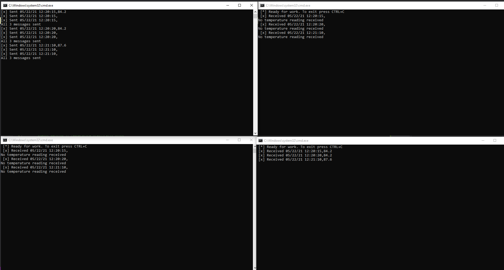
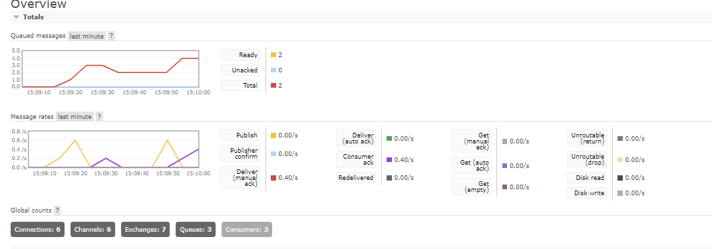
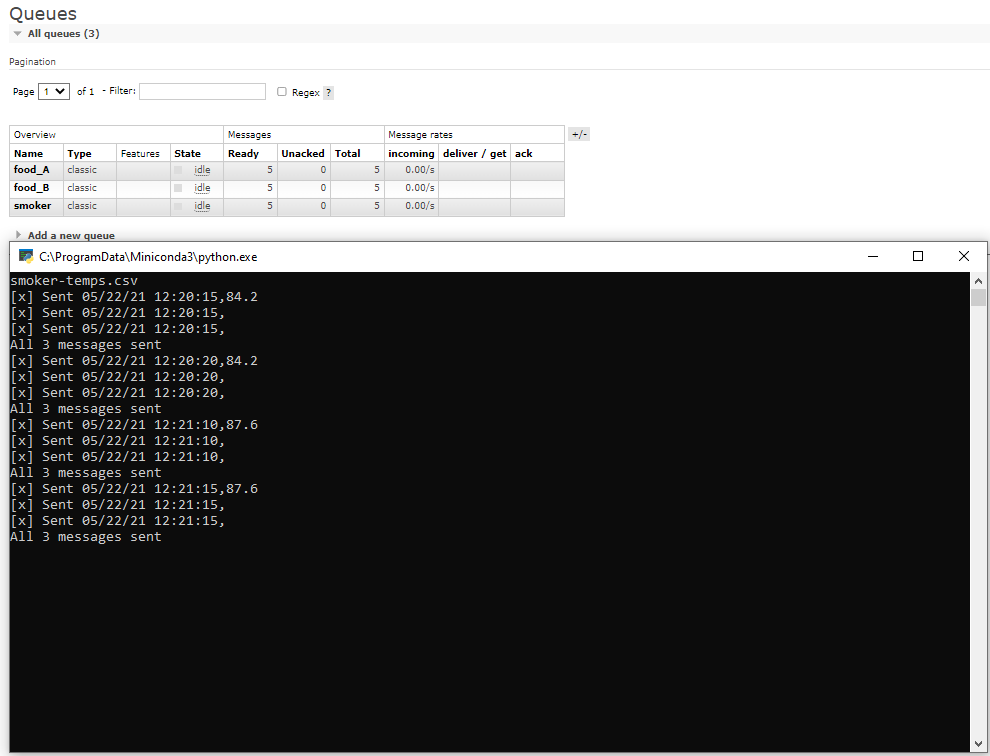

#streaming-05-smart-smoker

##Intro & Operation
This program is designed to simulate a smart smoker system to moniter real-time events within the smoker.
The system is designed around one RabbitMQ producer processing the temperature data and pushing it to three seperate consumers: One for smoker temp, and two for two diffeent foods.
Significant events that throw an alarm are when smoker temperature drops by greater than 15 degrees in 2.5 minutes, and when food temperature does not change by more than one degree for 10 minutes.
Temperature readings will be taken every thirty seconds.

To operate this program, the producer will first have to be started, followed by all three of the consumers.

##The Producer
Currently I have the program set up to read a .csv file and process the information contained into three seperate messages.
You will then see the periodic updates given by the console as each of the messages push to their queues.
Currently the time between updates is 30 seconds(simulating a temperature reading every 30 seconds.
Three separate queues currently exist, one for each of the temperatures we are tracking.

##The Consumers
There are three consumers packed in this program, one monitoring each of the queues established by the producer.
Upon receiving the messages they will attempt to read the temperatures given.
If  temperatures are received, they will be pushed to our time window, and will be cjhecked to see if they meet either of the significant events(sudden drop by 15 or more degrees in smoker temperature over 2.5 minutes, or stall of temperature of food over 10 minutes)

##Screenshots

Above we can see the producer and all three consumers working concurrently.

The RabbitMQ server overview is pictured above. This gives us a great view of our processies unfolding in real time.

This screenshot displays the queue view of our RabbitMQ admin page
